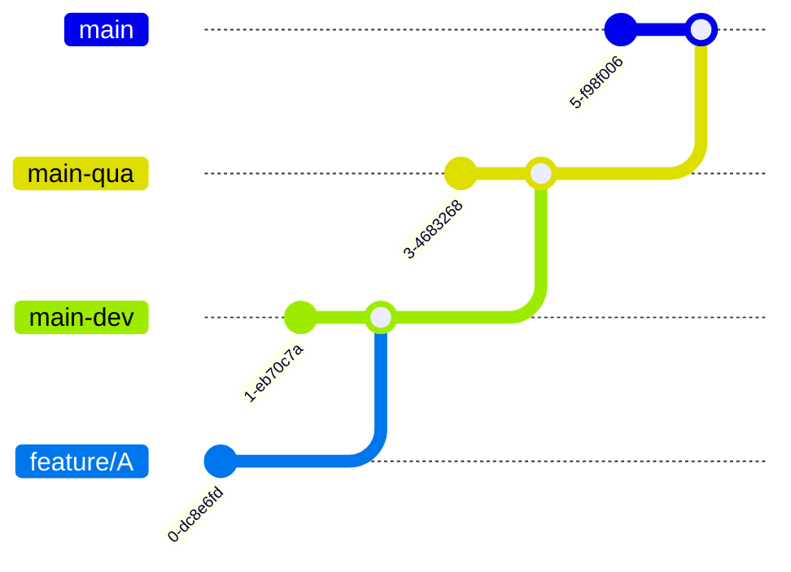

https://support.typora.io/Draw-Diagrams-With-Markdown/

## GIT - Dev to Uat
#### 1.Run only the first time (before running prereq)
```s
git clone https://github.com/abc/repo-uat.git
cd repo-uat
git remote add upstream https://github.com/abc/repo-dev.git
git config merge.ours.driver true
git checkout main
git checkout upstream/main -- .gitattributes
git commit -m "Added .gitattributes"
git push
```
#### 2.Run each time
```s
git checkout main
git pull --prune
git branch -D release/uat
git fetch upstream
git diff main upstream/main -- ':!/.github/address_spaces.txt' ':!/.github/workflows/context.json'
git checkout -b release/uat
git merge upstream/main --allow-unrelated-histories --strategy-option theirs
git push --set-upstream origin release/uat
```
#### 3.Run pipeline on release/uat branch - only plan
#### 4.Create a pull request into main
#### 5.Run pipeline on main branch
