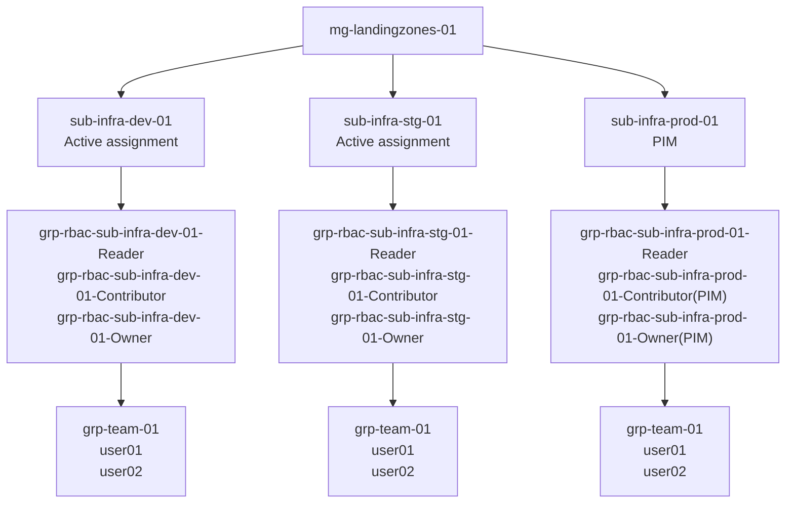

Varje subscription får 3 grupper (Reader, Contributor, Owner). Grupperna ska användas för att tilldela behörigheter till samtliga teams. Behörigheter skall inte tilldelas direkt på subscriptions. Undantag från den regeln blir när man ska tilldela en special behörighet, t.ex. Key Vault Administrator.

Produktionsmiljön använder PIM (Contributor och Owner). Dev- och stagemiljön får active assigment.  

Ett exempel:

