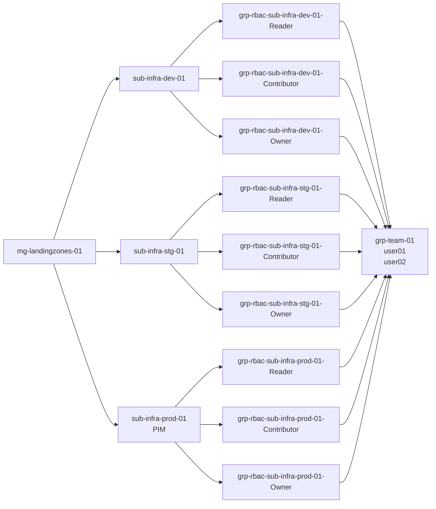

```mermaid
graph LR
A[mg-landingzones-01]
A -->B[sub-infra-dev-01]
A -->C[sub-infra-stg-01]
A -->D["sub-infra-prod-01
PIM"]

B --> F[grp-rbac-sub-infra-dev-01-Reader]
B --> G[grp-rbac-sub-infra-dev-01-Contributor]
B --> H[grp-rbac-sub-infra-dev-01-Owner]

C --> I[grp-rbac-sub-infra-stg-01-Reader]
C --> J[grp-rbac-sub-infra-stg-01-Contributor]
C --> K[grp-rbac-sub-infra-stg-01-Owner]

D --> L[grp-rbac-sub-infra-prod-01-Reader]
D --> M[grp-rbac-sub-infra-prod-01-Contributor]
D --> N[grp-rbac-sub-infra-prod-01-Owner]

O["grp-team-01
user01
user02"]

F --> O
G --> O
H --> O

I --> O
J --> O
K --> O

L --> O
M --> O
N --> O
```

