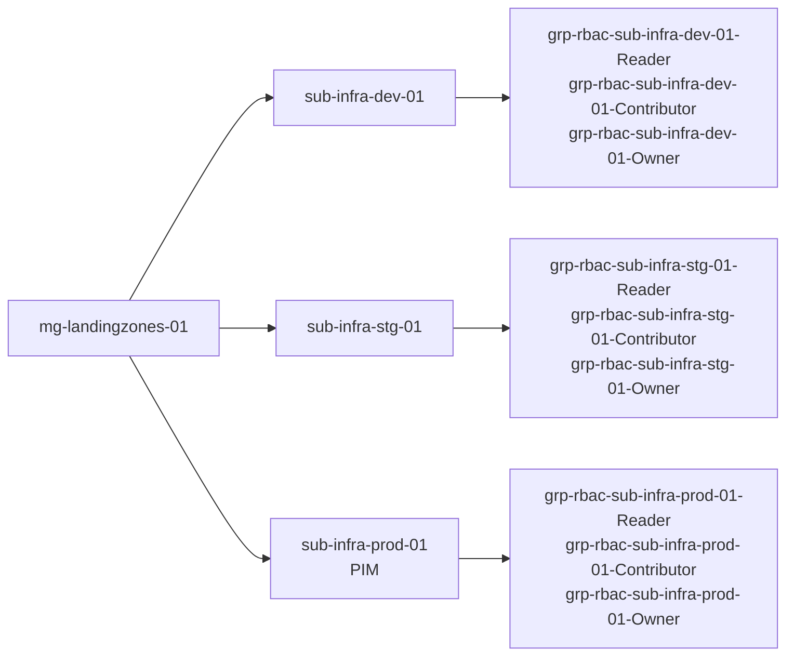

```mermaid
graph LR
A[mg-landingzones-01]
A -->B[sub-infra-dev-01]
A -->C[sub-infra-stg-01]
A -->D["sub-infra-prod-01
PIM"]

B --> F["grp-rbac-sub-infra-dev-01-Reader
    grp-rbac-sub-infra-dev-01-Contributor
    grp-rbac-sub-infra-dev-01-Owner"]

C --> G["grp-rbac-sub-infra-stg-01-Reader
    grp-rbac-sub-infra-stg-01-Contributor
    grp-rbac-sub-infra-stg-01-Owner"]

D --> H["grp-rbac-sub-infra-prod-01-Reader
    grp-rbac-sub-infra-prod-01-Contributor
    grp-rbac-sub-infra-prod-01-Owner"]
   
```
