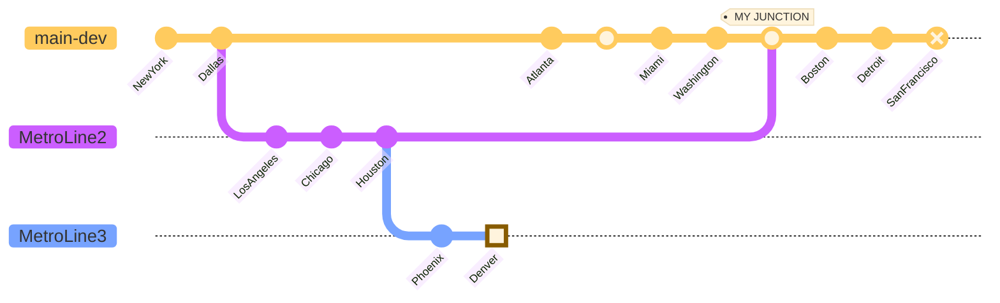
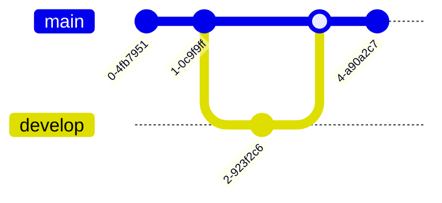

```mermaid
gitGraph
       checkout main
       branch feature/A
       commit
       checkout main
       merge feature/A
       checkout main
       branch release/qua
       commit
       checkout main
       merge release/qua
       checkout main
```




