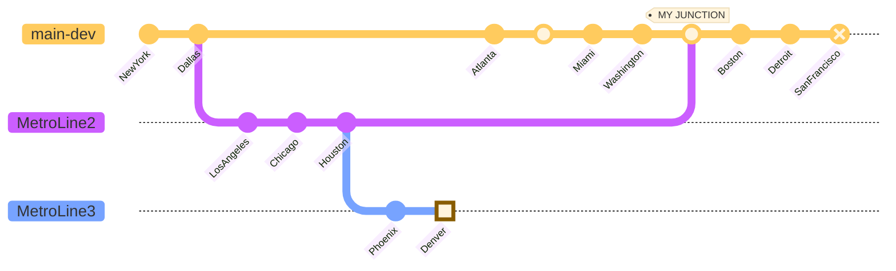

```mermaid
gitGraph
       commit
       branch feature/A
       checkout feature/A
       commit
       checkout main
       merge feature/A
       commit
       branch feature/A
```

```mermaid
%%{init: { 'logLevel': 'debug', 'theme': 'base', 'gitGraph': {'showBranches': true, 'showCommitLabel':true,'mainBranchName': 'main-dev'}} }%%
      gitGraph
        commit id:"NewYork"
        commit id:"Dallas"
        branch MetroLine2
        commit id:"LosAngeles"
        commit id:"Chicago"
        commit id:"Houston"
        branch MetroLine3
        commit id:"Phoenix"
        commit type: HIGHLIGHT id:"Denver"
        commit id:"Boston"
        checkout main-dev
        commit id:"Atlanta"
        merge MetroLine3
        commit id:"Miami"
        commit id:"Washington"
        merge MetroLine2 tag:"MY JUNCTION"
        commit id:"Boston"
        commit id:"Detroit"
        commit type:REVERSE id:"SanFrancisco"
```