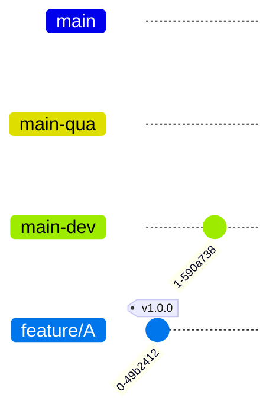
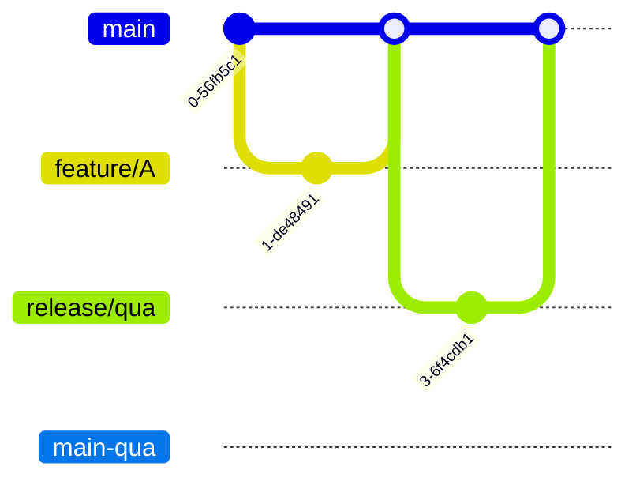

       <!-- commit
       checkout main-qua
       commit
       merge main-dev
       checkout main
       commit
       merge main-qua -->



gitGraph
       branch main-qua
       branch main-dev
       commit
       checkout main-qua
       commit
       merge main-dev
       checkout main
       commit
       merge main-qua
       branch feature/A
```